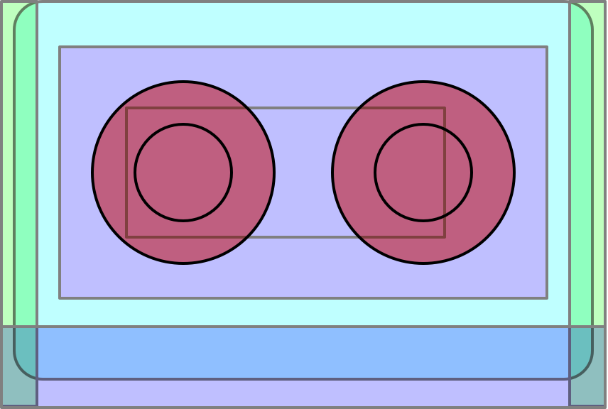

# Mixtape.jl

<p align="center">

</p>
<br>

| **Build Status**                                       | **Coverage**                    | **Documentation** |
|:------------------------------------------------------:|:-------------------------------:|:-----------------:|
| [![][gha-1.6-img]][gha-url] [![][gha-nightly-img]][gha-url] | [![][codecov-img]][codecov-url] | [![][dev-docs-img]][dev-docs-url] |

[gha-1.6-img]: https://github.com/femtomc/Mixtape.jl/workflows/julia-1.6/badge.svg
[gha-nightly-img]: https://github.com/femtomc/Mixtape.jl/workflows/julia-nightly/badge.svg
[gha-url]: https://github.com/femtomc/Mixtape.jl/actions
[codecov-img]: https://codecov.io/github/femtomc/Mixtape.jl/badge.svg?branch=master
[codecov-url]: https://codecov.io/github/femtomc/Mixtape.jl?branch=master
[dev-docs-img]: https://img.shields.io/badge/docs-dev-blue.svg
[dev-docs-url]: https://femtomc.github.io/Mixtape.jl/dev

> **Note**: Usage of this package requires `julia >= 1.6`.

```
] add Mixtape
```

---

`Mixtape.jl` is a static method overlay and optimization tool which operates during Julia type inference. It allows you to (precisely) insert semantic-intruding changes to lowered code (e.g. replace `CodeInfo`, pre-optimize `CodeInfo`, and create other forms of static analysis tools on uninferred `CodeInfo`) _before optimization_. It also allows you to customize the optimization pipeline -- allowing users to write semantic-preserving passes on [Core.Compiler.IRCode](https://github.com/JuliaLang/julia/blob/master/base/compiler/ssair/ir.jl) which operate _after inference_.

> **Note**: `Mixtape.jl` manages its own code cache and execution engine through [LLVM.jl](https://github.com/maleadt/LLVM.jl) and [GPUCompiler.jl](https://github.com/JuliaGPU/GPUCompiler.jl) -- so it is less part of Julia's native pipeline, and closer to a separate compiler pipeline. In the future, parts of `Mixtape.jl` may be integrated or otherwise exposed as standard APIs with the compiler.

In many respects, it is similar to [Cassette.jl](https://github.com/JuliaLabs/Cassette.jl) -- _but it is completely static_.

> **Note**: the architecture for this package can be found in many other places. The interested reader might look at [KernelCompiler.jl](https://github.com/vchuravy/KernelCompiler.jl), [Enzyme.jl](https://github.com/wsmoses/Enzyme.jl), [the Julia frontend to brutus](https://github.com/JuliaLabs/brutus/blob/master/Brutus/src/Brutus.jl), and the [compiler interface in GPUCompiler.jl](https://github.com/JuliaGPU/GPUCompiler.jl/blob/master/src/interface.jl) to understand this a bit better.
>
> When in doubt, don't be afraid of [typeinfer.jl](https://github.com/JuliaLang/julia/blob/master/base/compiler/typeinfer.jl) and [Julia's SSA form IR](https://github.com/JuliaLang/julia/tree/master/base/compiler/ssair)!

## Interfaces

```julia
using Mixtape
using Mixtape: jit, @load_call_interface
import Mixtape: CompilationContext, 
                allow, 
                transform, 
                optimize!,
                show_after_inference,
                show_after_optimization, 
                debug
```

`Mixtape.jl` exports a set of interfaces which allows you to interact with aspects of Julia's type inference to modify the lowered code of method instances before placement into a runtime cache. This code can then be executed as part of a self-managed code generation pipeline. This code generation pipeline works through the [LLVM.jl](https://github.com/maleadt/LLVM.jl) and [GPUCompiler.jl](https://github.com/JuliaGPU/GPUCompiler.jl) infrastructure.

> In other words, you can futz with stuff without refactoring the stuff.

[The interfaces are well-documented (if experimental).](https://femtomc.github.io/Mixtape.jl/dev/)

This package pairs well with [CodeInfoTools.jl](https://github.com/femtomc/CodeInfoTools.jl).

## Examples

Now easy as 1, 2, 3!

1. [Start simple!](https://github.com/femtomc/Mixtape.jl/blob/master/examples/simple.jl)
2. [Recursive musings...](https://github.com/femtomc/Mixtape.jl/blob/master/examples/recursion.jl)
3. [Have you considered that it is interpreters all the way down?](https://github.com/femtomc/Mixtape.jl/blob/master/examples/cassette.jl)

## Package contribution

A few upsides!

1. Completely static -- does not rely on recursive pollution of the call stack (see: [the overdub issue](https://julia.mit.edu/Cassette.jl/stable/overdub.html)).
2. Transforms operate pre-type inference -- all semantic-intruding changes happen before type inference runs on the lowered method body.
3. `Mixtape.jl` manages its own code cache -- and doesn't interact with the native runtime system (see above).

A few downsides...

1. `Mixtape.jl` uses a custom execution engine through `GPUCompiler.jl` -- code which causes `GPUCompiler.jl` to fail will also cause `Mixtape.jl` to fail. In practice, this means you can't use the pipeline on dispatch tuples with `Union{As...}` or `Any` -- you must specify a non-dynamic type.
