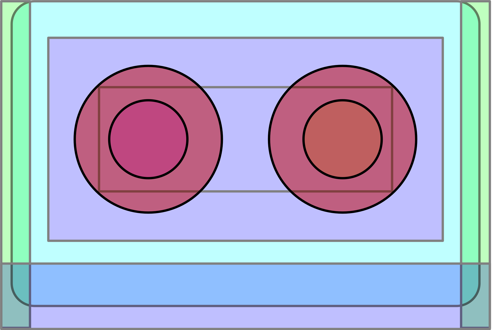

# Mixtape.jl

<p align="center">

</p>
<br>

> **Note**: Usage of this package requires `julia >= 1.6`.

```
] add https://github.com/femtomc/CodeInfoTools.jl
] add https://github.com/femtomc/Mixtape.jl
```

---

`Mixtape.jl` is a static method overlay and optimization tool which operates during Julia type inference. It allows you to (precisely) replace `CodeInfo`, pre-optimize `CodeInfo`, and create other forms of static analysis tools on uninferred `CodeInfo` as part of Julia's native type inference system. It also allows you to customize the optimization pipeline after inference -- allowing users to write semantic-preserving passes on [Core.Compiler.IRCode](https://github.com/JuliaLang/julia/blob/master/base/compiler/ssair/ir.jl).

In many respects, it is similar to [Cassette.jl](https://github.com/JuliaLabs/Cassette.jl) -- _but it is completely static_.

> **Note**: the architecture for this package can be found in many other places. The interested reader might look at [KernelCompiler.jl](https://github.com/vchuravy/KernelCompiler.jl), [Enzyme.jl](https://github.com/wsmoses/Enzyme.jl), [the Julia frontend to brutus](https://github.com/JuliaLabs/brutus/blob/master/Brutus/src/Brutus.jl), and the [compiler interface in GPUCompiler.jl](https://github.com/JuliaGPU/GPUCompiler.jl/blob/master/src/interface.jl) to understand this a bit better.
>
> When in doubt, don't be afraid of [typeinfer.jl](https://github.com/JuliaLang/julia/blob/master/base/compiler/typeinfer.jl) and [Julia's SSA form IR](https://github.com/JuliaLang/julia/tree/master/base/compiler/ssair)!

## Interfaces

```julia
using Mixtape
using Mixtape: jit, @load_call_interface
import Mixtape: CompilationContext, 
                allow, 
                transform, 
                optimize!,
                show_after_inference,
                show_after_optimization, 
                debug
```

`Mixtape.jl` exports a set of interfaces which allows you to interact with aspects of Julia's type inference to modify pre-inferred method instances _before inference_. This code can then be executed as part of a self-managed code generation pipeline. This code generation pipeline works through the [LLVM.jl](https://github.com/maleadt/LLVM.jl) and [GPUCompiler.jl](https://github.com/JuliaGPU/GPUCompiler.jl) infrastructure.

> In other words, you can futz with stuff without refactoring the stuff.

Usage of this package might proceed as follows.

## Example

We may start with some unassuming code.

```julia
# Unassuming code in an unassuming module...
module SubFoo

function h(x)
    return rand()
end

function f(x)
    x = rand()
    y = rand()
    return x + y + h()
end

end
```

Now, we define a new subtype of `CompilationContext` which we will use to parametrize the pipeline using dispatch.

```julia
# 101: How2Mix
struct MyMix <: CompilationContext end

# Operates on `CodeInfoTools` `Builder` instances
function transform(::MyMix, b)
    for (v, st) in b
        st isa Expr || continue
        st.head == :call || continue
        st.args[1] == Base.rand || continue
        replace!(b, v, 5)
    end
    display(b)
    return b
end

# MyMix will only transform functions which you explicitly allow.
allow(ctx::MyMix, fn::typeof(SubFoo.h), a...) = true

# You can greenlight whole modules, if you so desire.
allow(ctx::MyMix, m::Module) = m == SubFoo

# Debug printing.
show_after_inference(ctx::MyMix) = false
show_after_optimization(ctx::MyMix) = false
debug(ctx::MyMix) = false
```

When applying `jit` with a new instance of `MyMix`, the pipeline is applied.

```julia
fn = Mixtape.jit(MyMix(), SubFoo.f, Tuple{Float64})

@assert(fn() == 15)
@assert(SubFoo.f() != 15)
```

We get to see the transformation on `CodeInfo` as part of the call to `transform`.

Before:

```
CodeInfo(
    @ /Users/mccoybecker/dev/Mixtape.jl/examples/simple.jl:10 within `f'
1 ─      x = (rand)()
│        y = (rand)()
│   %3 = x
│   %4 = y
│   %5 = (Main.How2Mix.SubFoo.h)()
│   %6 = (+)(%3, %4, %5)
└──      return %6
)
CodeInfo(
    @ /Users/mccoybecker/dev/Mixtape.jl/examples/simple.jl:7 within `h'
1 ─ %1 = (rand)()
└──      return %1
)
```

After:

```
CodeInfo(
    @ /Users/mccoybecker/dev/Mixtape.jl/examples/simple.jl:10 within `f'
1 ─      x = 5
│        y = 5
│   %3 = x
│   %4 = y
│   %5 = (Main.How2Mix.SubFoo.h)()
│   %6 = (+)(%3, %4, %5)
└──      return %6
)
CodeInfo(
    @ /Users/mccoybecker/dev/Mixtape.jl/examples/simple.jl:7 within `h'
1 ─ %1 = 5
└──      return %1
)
```

## Package contribution

A few upsides!

1. Completely static -- does not rely on recursive pollution of the call stack (see: [the overdub issue](https://julia.mit.edu/Cassette.jl/stable/overdub.html)).
2. Transforms operate pre-type inference -- all semantic-intruding changes happen before type inference runs on the lowered method body.
3. `Mixtape.jl` manages its own code cache -- and doesn't interact with the native runtime system (see above).

A few downsides...

1. `Mixtape.jl` uses a custom execution engine through `GPUCompiler.jl` -- code which causes `GPUCompiler.jl` to fail will also cause `Mixtape.jl` to fail. In practice, this means you can't use the pipeline on dispatch tuples with `Union{As...}` or `Any` -- you must specify a non-dynamic type.
